# Learning cards

### The project is under development. The purpose of this project is to help people learn something new

https://learning-by-cards.vercel.app/

Below you can see a bit of information about authorisation flow
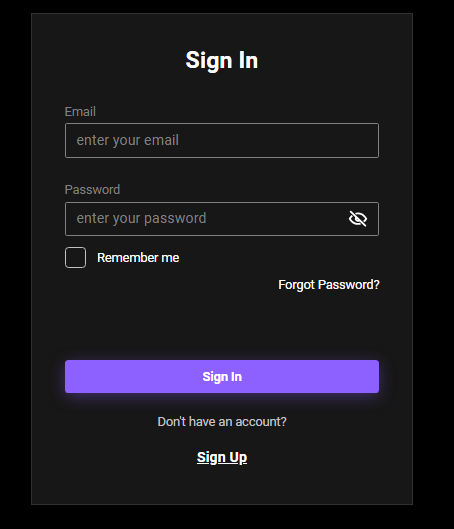
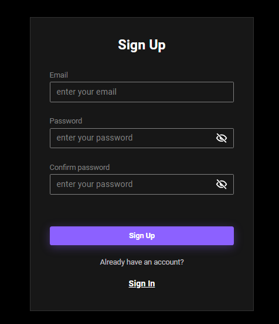
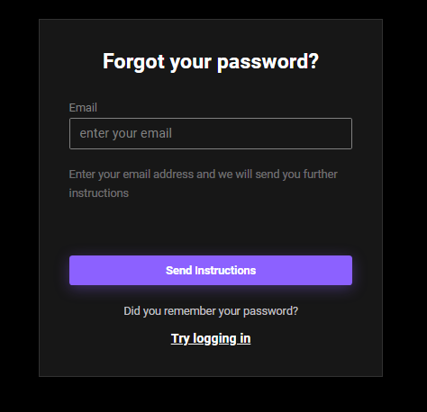
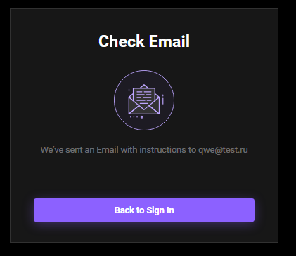
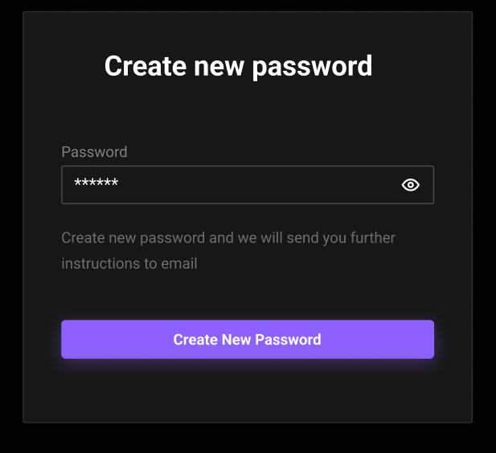

Here you can select the deck you would like to learn, delete or edit. You can also set up filters to search for the deck you want to learn
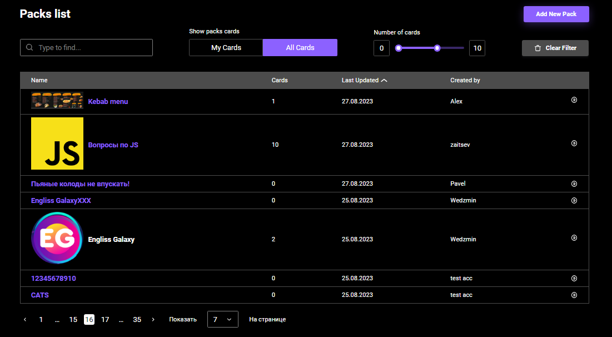
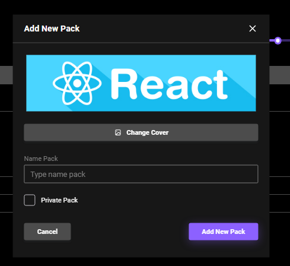
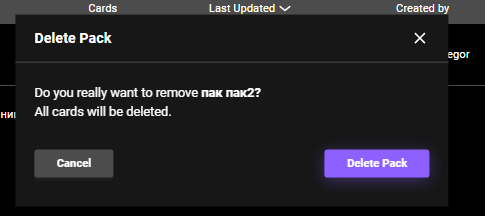
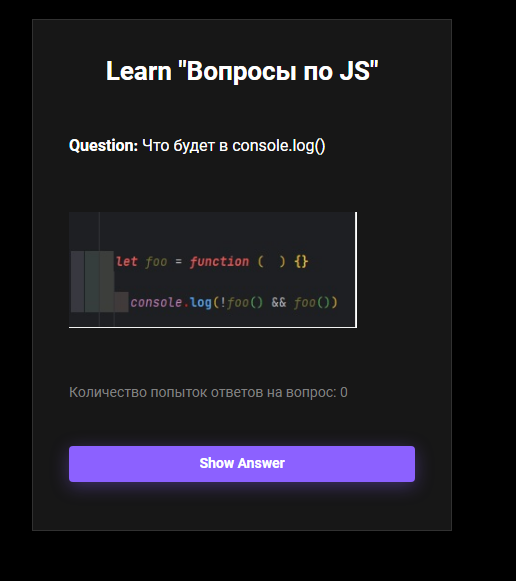
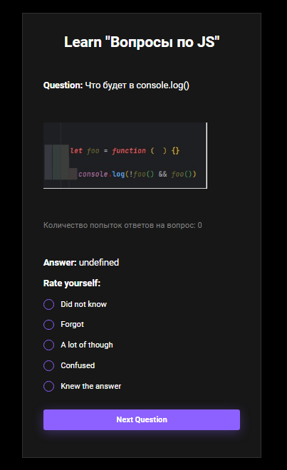

Also going to the deck page, you can add question and answer cards. As well as the necessary interaction functions (add, edit, delete)
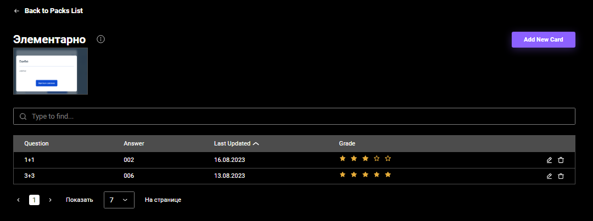
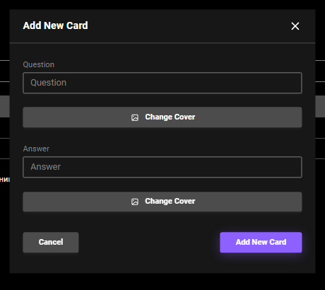

In this project has a profile page where you can update your photo or change your nickname
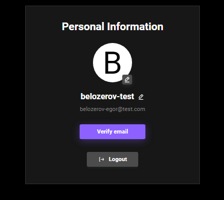

The project is under development. Some features may be unavailable.
If you have questions or want to know something, you can write to [me](https://t.me/belozerov_egor).

---

### Technologies:

- React
- TypeScript
- Redux-Toolkit
- RTK-Query
- React-Hook-Form
- React-Router-Dom
- Storybook
- Reselect
- React-Toastify
- Zod
- Framer-Motion
- Radix-Ui
- Eslint
- Prettier

test user password: test@test,
          email: belozerov-egor@test.com

To learn React, check out the [React documentation](https://reactjs.org/).
